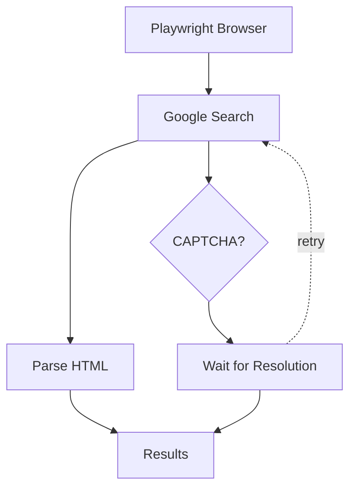

# 🔍 Web Search MCP Server

[](https://www.python.org/downloads/)
[](https://playwright.dev)
[](https://modelcontextprotocol.io)

A powerful **Google Search integration** powered by Playwright and MCP (Model Context Protocol), featuring intelligent CAPTCHA handling and persistent browser sessions.

---

## 🚀 Features

- **Google Search Query Execution** — Perform Google searches with natural language queries
- **Smart CAPTCHA Detection & Handling** — Automatically detects reCAPTCHA challenges and waits for manual resolution
- **Persistent Browser Profile** — Maintains session state using Chrome user data directory
- **JSON-RPC Response Format** — Returns structured, parseable search results
- **Real-time Logging** — Detailed logging with line-buffered stream handler
- **MCP Integration** — Built as an MCP server for seamless AI model integration

---

## 🛠️ Architecture



---

## 📦 Installation

```bash
# Clone the repository
git clone <repository-url>
cd playwirght

# Install dependencies with uv
uv sync

# Set up environment variables
cp .env.example .env
# Edit .env with your Chrome user data directory path
```

---

## 🚀 Quick Start

### Run as MCP Server

```bash
python -m plsearch
```

The server starts on stdio transport and waits for MCP requests.

### Query Format

Send a JSON-RPC request with:

```json
{
  "method": "Web_search",
  "params": {
    "state": "your search query here"
  }
}
```

### Response Format

```json
[
  {
    "type": "web_search_result",
    "title": "Result Title",
    "url": "https://example.com",
    "page_content": "Result description snippet",
    "page_age": ""
  }
]
```

---

## ⚙️ Configuration

| Environment Variable | Description | Default |
|----------------------|-------------|---------|
| `PROFILE_DIR` | Chrome user data directory for persistent sessions | - |

---

## 🔒 CAPTCHA Handling

When Google detects automated activity, it presents a reCAPTCHA challenge. This tool handles CAPTCHA gracefully:

1. **Detection** — Automatically identifies CAPTCHA pages via DOM element inspection
2. **Notification** — Logs warning message: `CAPTCHA detected! Solve it manually in the browser...`
3. **Waiting** — Polls the page every second, checking for CAPTCHA removal
4. **Continuation** — Once solved, proceeds with parsing the search results

> **Note**: The browser runs in visible mode (`headless=False`) so you can interact with the CAPTCHA.

---

## 📝 Logging

Logs are written to `logs/search.log` with the following format:

```
2026-05-11 16:45:12 | INFO     | web_search | Starting Chrome browser in visible mode...
2026-05-11 16:45:12 | INFO     | web_search | Browser successfully started
2026-05-11 16:45:12 | WARNING  | web_search | CAPTCHA detected! Solve it manually in the browser...
2026-05-11 16:45:17 | INFO     | web_search | CAPTCHA solved! Continuing...
```

---

## 🧪 Testing

This project includes a comprehensive test suite using pytest and Playwright.

### Test Structure

- **`tests/test_parse_page.py`** — Unit tests for HTML parsing logic (8 tests)
- **`tests/test_integration.py`** — Integration tests with real browser (3 tests, require `--slow --headed`)
- **`tests/conftest.py`** — Pytest configuration and fixtures

### Running Tests

```bash
# Run unit tests only (fast, no browser required)
pytest tests/ --ignore=tests/test_integration.py -v

# Run integration tests with visible browser (CAPTCHA-capable)
pytest tests/test_integration.py -v --slow --headed
```

> **Why two invocations?** `pytest-playwright`'s synchronous `page` fixture (used
> by integration tests) and `pytest-asyncio`'s test loop (used by `main.run` mock
> tests) can't share the same Python event loop on the same thread. Mixing them
> in a single `pytest tests/ --slow --headed` invocation causes the async unit
> tests to fail with `Cannot run the event loop while another loop is running`.
> Running them in separate processes sidesteps the conflict.

### Human-in-the-Middle Pattern

For integration tests that may encounter CAPTCHA:

1. Test detects CAPTCHA automatically by checking DOM elements
2. Test pauses and waits for manual resolution in the browser window
3. Automatic polling checks every second if CAPTCHA is gone
4. Test continues automatically once CAPTCHA is solved

> **Note**: Use `--slow --headed` to run tests with a visible browser window, allowing you to manually resolve CAPTCHA challenges. The `--slow` flag without `--headed` runs tests in headless mode where CAPTCHA cannot be solved manually.

---

## 🏗️ Project Structure

```
playwirght/
├── src/
│   ├── plsearch/
│   │   ├── __init__.py
│   │   ├── main.py          # MCP server & browser orchestration
│   │   ├── parse_page.py    # HTML parsing logic
│   │   └── __pycache__/
│   └── logs/
│       └── search.log       # Runtime logs
├── data/                    # Data directory
├── profile/                 # Browser profile storage
├── test.html                # Sample CAPTCHA page HTML
├── pyproject.toml           # Project dependencies
└── README.md                # This file
```

---

## 🔧 Dependencies

- **playwright** — Browser automation and CAPTCHA handling
- **beautifulsoup4** — HTML parsing and result extraction
- **httpx** — HTTP client for API requests
- **mcp** — Model Context Protocol server framework
- **python-dotenv** — Environment variable management

---

## 🤝 Contributing

Contributions are welcome! Please feel free to submit a Pull Request.

---

## 📄 License

This project is licensed under the MIT License.

---

<p align="center">
  Made with ❤️ using <a href="https://playwright.dev">Playwright</a> and <a href="https://modelcontextprotocol.io">MCP</a>
</p>
