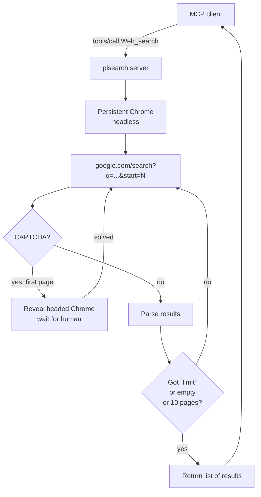

# 🔍 plsearch — Google Search as an MCP Tool

[](https://www.python.org/downloads/)
[](https://playwright.dev)
[](https://modelcontextprotocol.io)
[](#-license)
[](#-development)

> A free, local, browser-driven **Google Search** exposed as an MCP tool — drop-in replacement for paid web-search APIs in Claude Code, LM Studio, and any MCP-compatible client.

`plsearch` is a long-running MCP server that drives a persistent Chrome profile through Playwright. It walks Google's pagination, parses results, and serves them over **streamable-http**. Headless by default; pops up a visible window only when Google challenges with reCAPTCHA so you can solve it once and keep going.

---

## ✨ Why plsearch

- **Zero API cost** — no Brave/Serper/Tavily keys, no per-query billing
- **Persistent profile** — one warm Chrome session reuses cookies, dramatically lowering CAPTCHA frequency vs. fresh launches
- **Headless by default** — invisible during normal use; reveals only for CAPTCHA, then hides again
- **Multi-page walk** — `limit` parameter pulls up to ~100 results across Google's `start=0,10,20,…` pagination on a single tab
- **Multi-client** — one server, many concurrent MCP clients (Claude Code + LM Studio + Inspector); requests serialize on a shared browser
- **Drop-in CLI** — `uv run plsearch "query"` for shell scripts and quick debugging
- **Battle-tested** — 94 unit tests, integration tests against live Google, structured logging with rotation

---

## 🚀 Quick Start (60 seconds)

```bash
# 1. Clone and install
git clone <repository-url> plsearch
cd plsearch
uv sync
uv run playwright install chrome     # one-time, if Chrome isn't on the host

# 2. Prepare an empty directory for the Chrome profile and point at it
#    The directory MUST be empty — Chrome will populate it on first launch.
#    Example paths:
#      Windows: C:/Users/you/plsearch-profile
#      macOS:   /Users/you/plsearch-profile
mkdir -p /Users/you/plsearch-profile
echo 'PROFILE_DIR="/Users/you/plsearch-profile"' > .env

# 3. Start the server
uv run python -m plsearch.main
```

> **Tested platforms:** Windows and macOS. Linux should work but is currently unverified.

The server binds to `http://127.0.0.1:8765/mcp` and stays up across client sessions. Leave it in a terminal, or wire it into systemd / Task Scheduler for autostart.

> **First-run tip:** on the very first query, open the visible Chrome that appears, sign in to Google once, and solve any initial CAPTCHA. The session persists in `PROFILE_DIR` — subsequent runs are usually silent.

---

## 🔌 Connecting clients

The transport is **streamable-http** — every MCP client that speaks it just needs the URL.

### Claude Code

Add to `~/.claude.json`:

```json
{
  "mcpServers": {
    "WebSearch": { "url": "http://127.0.0.1:8765/mcp" }
  }
}
```

Restart Claude Code; the `Web_search` tool appears under `mcp__WebSearch__`.

### LM Studio

Open *Program → MCP Servers → Add Server*, pick **Streamable HTTP**, paste `http://127.0.0.1:8765/mcp`.

### MCP Inspector

```bash
npx @modelcontextprotocol/inspector
```

Choose **Streamable HTTP** as transport, paste the URL, click *Connect*. Great for poking at the tool by hand.

### Any MCP-compatible client

It's a standard streamable-http MCP endpoint — see the [MCP spec](https://modelcontextprotocol.io). One JSON-RPC `initialize` + `tools/call` and you're done.

---

## 🛠️ The `Web_search` tool

**Signature:**

```python
Web_search(state: str, limit: int = 10) -> list[dict]
```

**Parameters:**

| Field   | Type | Default | Notes                                                      |
|---------|------|---------|------------------------------------------------------------|
| `state` | str  | —       | The Google search query. Use Google operators freely (`site:`, `intitle:`, etc.). |
| `limit` | int  | 10      | Max results. The walker stops at `min(limit, ~100)`.       |

**Response:**

```json
[
  {
    "type": "web_search_result",
    "title": "asyncio — Asynchronous I/O",
    "url": "https://docs.python.org/3/library/asyncio.html",
    "page_content": "asyncio is a library to write concurrent code using async/await...",
    "page_age": ""
  }
]
```

The shape mirrors the Anthropic Web Search result schema, so it slots into existing prompts as a substitute. `page_age` is always `""` (Google doesn't expose reliable dates in result snippets).

---

## ⚡ CLI

The same server is also accessible as a shell command — handy for cron jobs, debug loops, or just curiosity:

```bash
uv run plsearch "python asyncio tutorial" --limit 5
uv run plsearch "site:github.com mcp servers" --limit 20
uv run plsearch "query" --host 127.0.0.1 --port 8765    # explicit endpoint
```

The CLI is a thin MCP client over streamable-http — it **talks to the running server**, it doesn't spin up its own Chrome. Output is JSON on stdout; exit codes are `0` (ok), `1` (server unreachable), `2` (tool error).

If the server isn't running, the CLI tells you so:

```text
plsearch: could not reach MCP server at http://127.0.0.1:8765/mcp: ...
start it with: uv run python -m plsearch.main
```

---

## 🏗️ How it works



- **One Chrome, one profile, one request at a time** — an `asyncio.Lock` serializes concurrent requests so a CAPTCHA-reveal in one doesn't yank the page out from under another.
- **Headless ↔ headed swap** — Playwright can't toggle `headless` on a live browser, so on CAPTCHA the server closes the headless Chrome and relaunches headed against the same `user_data_dir`. Cookies survive the swap; reveal/restart costs ~2-3 s.
- **CAPTCHA on later pages returns partial** — if Google challenges on page 3 of a multi-page walk, the server returns what it has rather than disturbing you. CAPTCHA on page 1 with empty results triggers the reveal flow.

---

## ⚙️ Configuration

`.env` (gitignored):

| Variable        | Required | Default     | Purpose                                                            |
|-----------------|----------|-------------|--------------------------------------------------------------------|
| `PROFILE_DIR`   | yes      | —           | Absolute path to an **empty** directory. Chrome creates its user-data profile here on first launch and persists Google cookies between runs. |
| `PLSEARCH_HOST` | no       | `127.0.0.1` | Bind host for the HTTP server.                                     |
| `PLSEARCH_PORT` | no       | `8765`      | Bind port for the HTTP server.                                     |

> **Security note:** Setting `PLSEARCH_HOST=0.0.0.0` exposes the server to your network with no authentication. Only do this behind a reverse proxy that adds auth.

---

## 🤖 CAPTCHA handling

The server keeps Chrome alive for its whole lifetime. During normal operation Chrome runs **headless** — no window, no flashing UI. When Google serves reCAPTCHA, the server:

1. **Detects** the challenge via DOM markers (`captcha-form`, `recaptcha` substrings)
2. **Reveals** a visible Chrome bound to the same `PROFILE_DIR` (cookies carry over)
3. **Waits** up to 120 s, polling once per second for the CAPTCHA to disappear
4. **Hides** the window again — next request is silent

If 120 s elapse without resolution the server raises a `RuntimeError` to the client. Reuse the same `PROFILE_DIR` across runs; Google challenges a familiar long-lived session far less than a fresh one.

---

## 🧪 Development

```bash
# Fast unit tests — no browser
uv run pytest tests/ --ignore=tests/test_integration.py -v

# Integration tests — real Google, may need human for CAPTCHA
uv run pytest tests/test_integration.py -v --slow --headed
```

> **Why two invocations?** `pytest-playwright`'s synchronous fixture and `pytest-asyncio`'s loop can't share a thread. Running them in separate processes sidesteps the conflict. Integration tests are CAPTCHA-gated and meant for occasional manual runs, not CI.

**Smoke-test the live server with curl** (cheapest end-to-end check, no Python needed):

```bash
curl -s -X POST http://127.0.0.1:8765/mcp \
  -H "Content-Type: application/json" \
  -H "Accept: application/json, text/event-stream" \
  -d '{"jsonrpc":"2.0","id":1,"method":"initialize","params":{"protocolVersion":"2024-11-05","capabilities":{},"clientInfo":{"name":"smoke","version":"1.0"}}}'
```

A 200 with `serverInfo.name=Web_search` means the server is healthy.

---

## 📂 Project layout

```
plsearch/
├── src/plsearch/
│   ├── main.py          # MCP server, lifespan, AppContext, request orchestration
│   ├── parse_page.py    # BeautifulSoup result extractor (a > h3 + div.VwiC3b)
│   ├── config.py        # Env helpers, CAPTCHA detection, pagination constants
│   ├── session.py       # Cross-process PID registry (single-server invariant)
│   └── cli/             # Thin streamable-http client (`uv run plsearch ...`)
├── tests/
│   ├── test_parse_page.py       # Unit: HTML parser
│   ├── test_main.py             # Unit: search orchestration with mocked Playwright
│   ├── test_config.py           # Unit: env, CAPTCHA detection, timeouts
│   ├── test_session.py          # Unit: PID registry & process tree kills
│   ├── test_cli.py              # Unit: CLI argparse, transport, output formatting
│   ├── test_integration.py      # Real Google, gated by --slow
│   └── test_real_google_fixture.py  # Fixture-based parser regression
├── pyproject.toml
└── README.md
```

---

## 📦 Runtime dependencies

| Package         | Why it's here                                              |
|-----------------|------------------------------------------------------------|
| `playwright`    | Browser automation, Chrome persistent context              |
| `beautifulsoup4`| HTML parsing (Google's `div.VwiC3b` snippets)              |
| `mcp[cli]`      | FastMCP server + client primitives used by the CLI         |
| `dotenv`        | Load `PROFILE_DIR` and friends from `.env`                 |

Managed by `uv` — `uv.lock` is the source of truth; do not hand-edit deps.

---

## 🤝 Contributing

Issues and PRs welcome. Quick orientation:

- **Style:** type hints on public functions, `logger = logging.getLogger(__name__)` per module, descriptive `def test_<behavior>` names with one assertion-group each.
- **Tests:** new behavior → unit test in `tests/`. Don't add features without coverage.
- **Don't:** commit `profiles/`, `.env`, or `logs/` — all gitignored for good reasons.

A more detailed contributor guide for AI agents working in this repo lives in `CLAUDE.md` (gitignored locally — see git history if you're forking).

---

## 📄 License

MIT.

---

<p align="center">
  If <code>plsearch</code> saves you an API bill, consider ⭐ starring the repo. <br/>
  Made with <a href="https://playwright.dev">Playwright</a> + <a href="https://modelcontextprotocol.io">MCP</a>.
</p>
